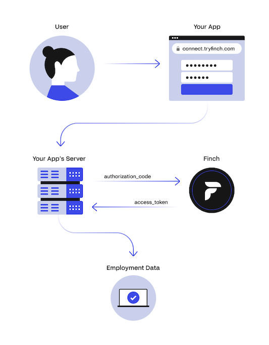

Finch is a Unified Employment API that enables you to build a single integration with Finch and instantly connect to hundreds of employment systems. Once Finch is integrated into your application, you can access your customers' company details, employment history, employee count, individual contact information, income details, company pay periods, and individual paycheck details like earnings, taxes, deductions, and contributions.

Finch works by allowing your customers (employers) to connect their employment systems (HRIS, Payroll, etc.) to your application. This connection process is facilitated through [Finch Connect](), our employer-facing user interface which provides an elegant and secure authorization flow where your customers (employers) approve permissions, select their provider, and authorize access to their employment systems. Upon a successful connection, Finch will issue an access token to your application which is used to make API requests to Finch API endpoints.

## Products

Finch offers three products: Organization, Payroll, and Deductions. Each product has its own set of endpoints, which provide specific data related to HRIS and payroll employment systems.

- Our [Organization]() product provides APIs to read company directory and employee data including contact information, demographics, departmental hierarchy, income history, and more.
- Our [Payroll]() product provides APIs for retrieving company payroll and inspecting individual paycheck information such as earnings, taxes, deductions, and contributions.
- Our [Deductions]() product provides APIs for creating, enrolling, and unenrolling individuals in deductions and contributions directly within the payroll provider.

## Finch Connect

Employers connect their data to your application in 4 easy steps, facilitated through [Finch Connect](). 

- **Prioritize privacy**: Finch Connect discloses data privacy practices right from the start, so your customers know where and how their data is used.
- **Confirm permissions**: Finch Connect displays the granular permissions needed to access the requested data. Finch only shares data that has been approved.
- **Select a provider**: Once the user approves, they select their employment system from Finch's list of 200+ integrations.
- **Authenticate access**: The user is prompted to log into their account (via credentials or API key if available), granting your application access to their employment data.

## Integration Types

Finch offers two [Integration Types]() that enable you to optimize for either data refresh cadence or long-tail provider coverage. This allows you to service *all* of your customers via Finch, no matter which employment systems they are using. Employers will go through different Finch Connect experiences depending on the integration type.  

## Connections

After an employer authenticates via Finch Connect, a connection is established between you and the employer via Finch. A [connection]() is a unique *Provider* + *App* + *Company* pairing, so several accounts from an employer for the same provider will still count as one connection.